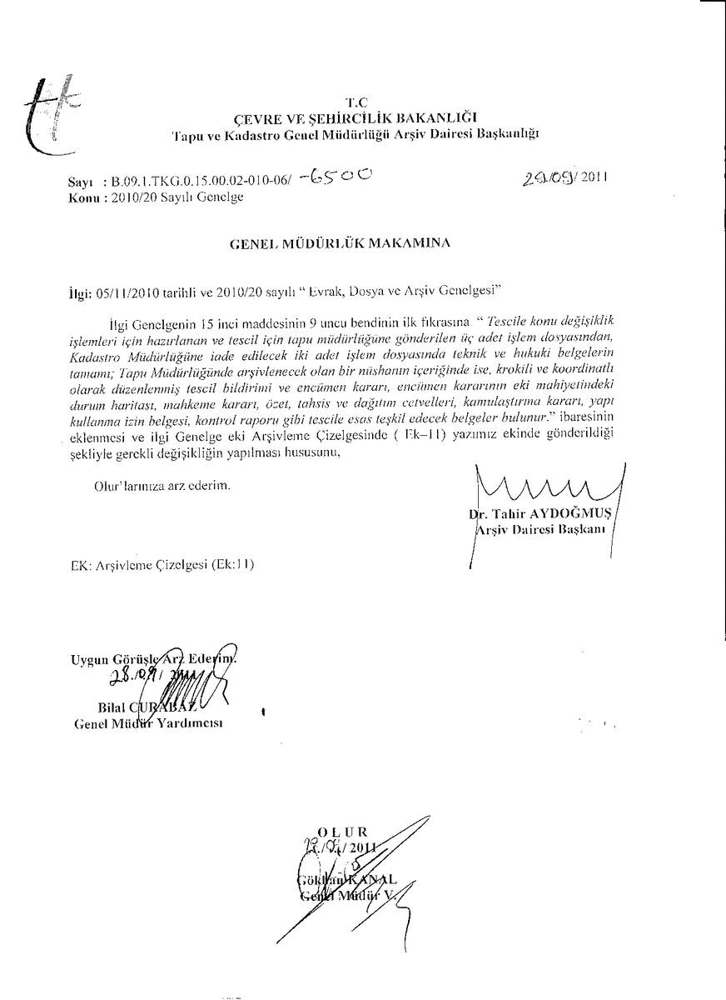
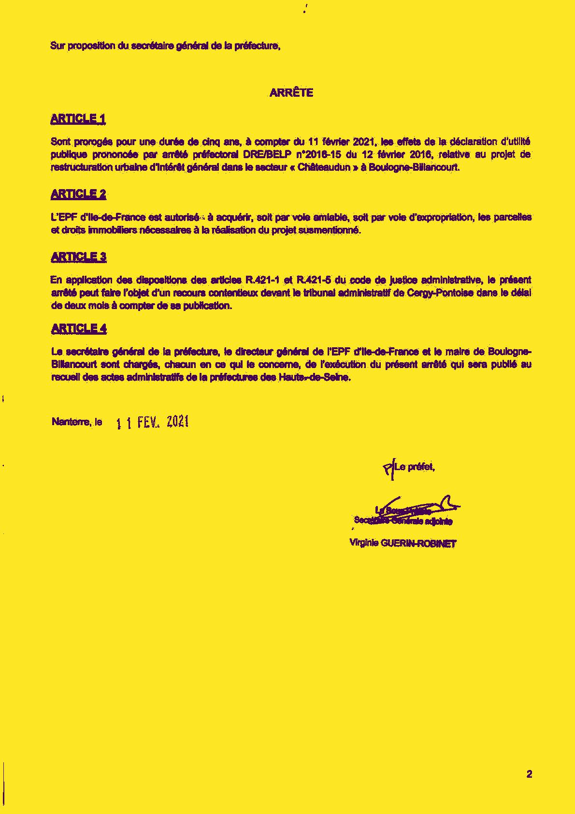
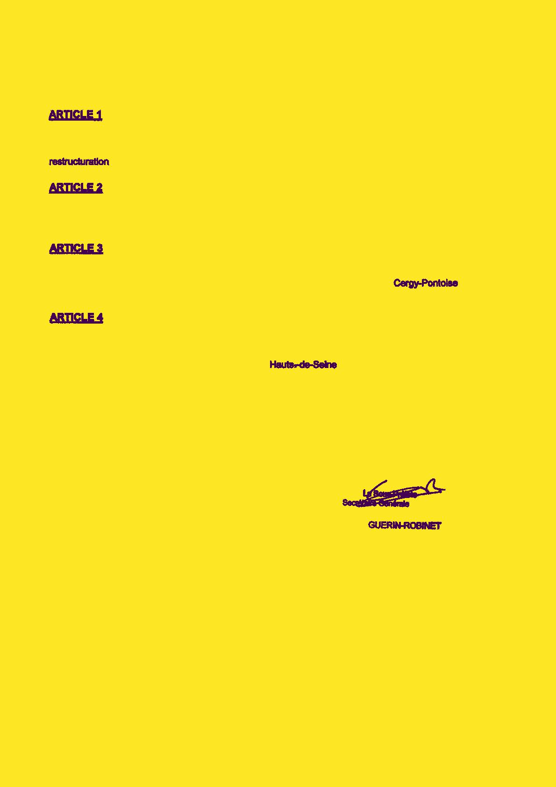

# Signature Detection

A simple tool to detect if there is **a signature** in **an image** or **a PDF file**.

## Installation of PyPi

It's the quick way to use this tool.

`signature-detect` package contains the codes in the `src`.

```
pip install signature-detect
```

## Installation of Anaconda

It's the recommended way to explore this tool. It provides notebooks for playing around. 

1. install [anaconda](https://docs.anaconda.com/anaconda/install/)

2. install dependencies

    ```
    conda create --name <env> --file conda.txt
    ```

## Demo

- Image:

    ```
    python demo.py --file my-image.jpeg
    ```

- PDF File:

    ```
    python demo.py --file my-file.pdf
    ```

## Unit Tests

All the codes in `src` are covered.

```
cd tests
coverage run -m unittest
coverage report -m
```

## Example

We use the following image as an example. The full example is in the [demo notebook](demo.ipynb)



### Loader
The loader reads the file and creates a mask.

The mask is a numpy array. The bright parts are set to 255, the rest is set to 0. It contains ONLY these 2 numbers.

#### Atrributes

- low_threshold = (0, 0, 250)

- high_threshold = (255, 255, 255)

They control the creation of the mask, used in the function `cv.inRange`.


#### Result

Here, yellow is `255`, purple is `0`.



### Extractor

The extractor, first, generates the regions from the mask. 

Then, it removes the small and the big regions because the signature is neither too big nor too small.

The process is as followed.

1. label the image

   `skimage.measure.label` labels the connected regions of an integer array. It returns a labeled array, where all connected regions are assigned the same integer value.

2. calculate the average size of regions

   Here, the size means **the number of the pixels in a region**. 

   We accumulate the number of the pixels in all the regions, `total_pixels`. The average size is `total_pixels / nb_regions`.

   If the size of a region is smaller `min_area_size`, this region is ignored. `min_area_size` is given by the user.

3. calculate the size of the small outlier

    ```
    small_size_outlier = average * outlier_weight + outlier_bias
    ```
    
    `outlier_weight` and `outlier_bias` are given by the user.

4. calculate the size of the big outlier

    ```
    big_size_outlier = small_size_outlier * amplfier
    ```

    `amplfier` is given by the user.

5. remove the small and big outliers

#### Attributes

- outlier_weight = 3

- outlier_bias = 100

- amplfier = 10 

  > `15` is used in the demo.

- min_area_size = 10

#### Result




### Cropper

The cropper finds the **contours** of regions in the **labeled masks** and crop them.

#### Attributes

Suppose `(h, w) = region.shape`.

- min_region_size = 10000

   If `h * w < min_region_size`, then this region is ignored.

- border_ratio: float

    border = min(h, w) * border_ratio

    The border will be removed if this attribute is not `0`.

#### Result


### Judger

The judger reads the cropped mask and identifies if it's a signature or not.

#### Attributes

Suppose `(h, w) = cropped_mask.shape`.

- size_ratio: [low, high]

    low < max(h, w) / min(h, w) < high.

- max_pixel_ratio: [low, high]

    low < the number of 0 / the number of 255 < high.

    The mask should only have 2 value, 0 and 255.

By default: 

- size_ratio = [1, 4]

- max_pixel_ratio = [0.01, 1]

#### Result

- `max(h, w) / min(h, w)` = 3.48

- number of `0` / number of `255` = 0.44

So, this image is signed.